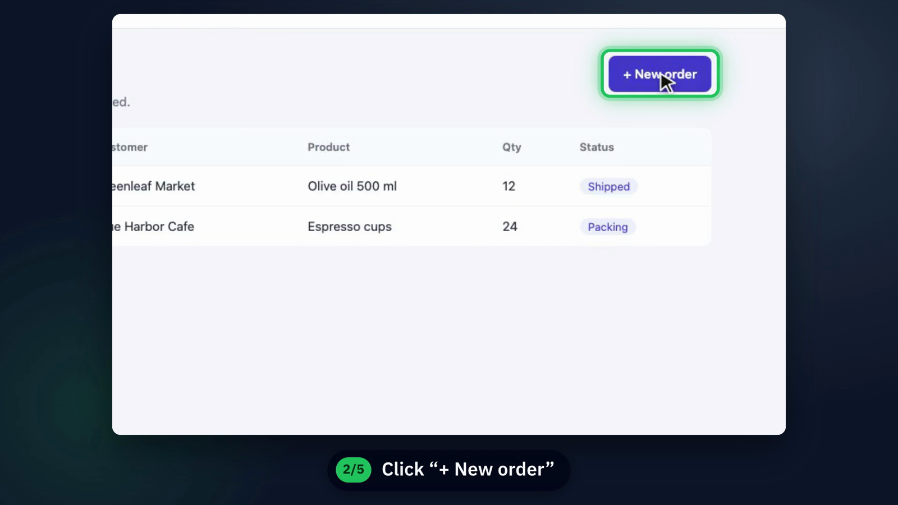
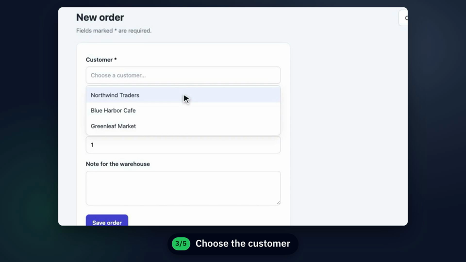
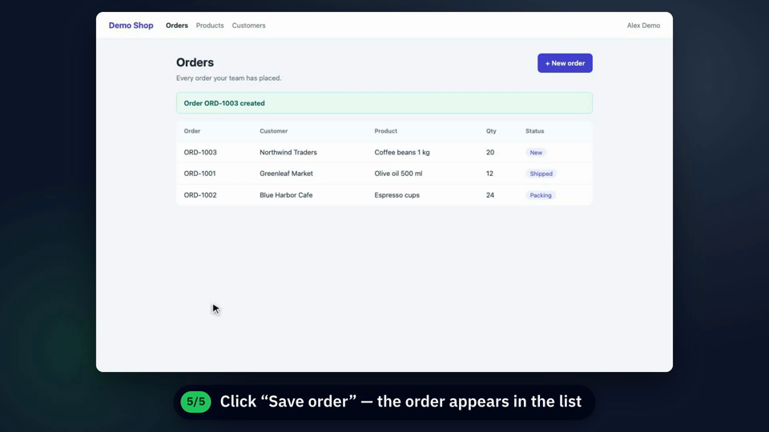

# TVideo

[English](README.md) · **ภาษาไทย**

[](https://github.com/JiramedFirst/TVideo/actions/workflows/smoke.yml)

Plugin สำหรับ Claude Code ที่ทำวิดีโอสอนใช้งานเว็บแอปให้อัตโนมัติ อัดหน้าจอจริงด้วย Playwright พร้อมเคอร์เซอร์ที่มองเห็นและจังหวะที่ตามทัน
แล้วตัดต่อด้วย Hyperframes: คำบรรยายทีละขั้น ซูมและกรอบเน้นปุ่มที่ต้องกด เสียงคลิก และเพลง ได้ไฟล์ MP4 1080p งานละหนึ่งคลิป

[](https://github.com/JiramedFirst/TVideo/releases/latest/download/TVideo-demo.mp4)



## ติดตั้ง

```
/plugin marketplace add JiramedFirst/TVideo
/plugin install tvideo@tvideo
```

อยากได้คู่มือเป็นสไลด์ (PPTX/PDF) แทนวิดีโอ ใช้ [MSlides](https://github.com/JiramedFirst/MSlides) ตัวพี่น้องกัน

## ใช้งาน

เปิดแอป (staging หรือในเครื่อง) ด้วยบัญชีเดโม แล้วสั่ง Claude เช่น

> ทำวิดีโอสอนลูกค้าสร้างคำสั่งซื้อบน staging.example.com

Claude จะแบ่งงานเป็นหนึ่งคลิปต่อหนึ่งงานแล้วตกลงรายการกับคุณก่อน แต่ละคลิปจะเขียน script Playwright และซ้อมโดยไม่อัดเพื่อพิสูจน์ว่าทุกปุ่มกดได้
จากนั้นอัดจริงและตัดต่อ ระบบจดตำแหน่งปุ่มที่ถูกคลิกไว้เอง กรอบเน้นจึงไม่ต้องวัดพิกัดด้วยมือ คุณได้ร่างไว้ดูก่อน แล้วจึงได้ไฟล์จริงใน
`<work>/clip-NN/renders/` พร้อม `captions.srt` / `.vtt`

UI เปลี่ยนเมื่อไหร่ ให้สั่งอัดคลิปนั้นใหม่ การตัดต่อสร้างจาก timeline และบันทึกการคลิกของการอัด คำบรรยาย ซูม กรอบเน้น และเสียงคลิกจึงตามภาพใหม่ไปเอง

คำบรรยายใช้ได้ทุกภาษา มีฟอนต์ไทยแถมมาให้ render ทั้งหมดในเครื่อง ต้องมีบัญชี HeyGen เฉพาะถ้าอยากได้เสียงพากย์ (ไม่บังคับ)
ติดปัญหาดู [troubleshooting](plugin/skills/tvideo/references/troubleshooting.md)

## สิ่งที่ต้องมี

- Node 20.11 ขึ้นไป และ ffmpeg
- Hyperframes skills: `npx hyperframes skills update general-video` (ติดตั้งเสียงประกอบให้ด้วย)
- Playwright + chromium ในโฟลเดอร์ recorder: `npm i` (ติดตั้ง chromium ให้เลย)

## รหัสผ่านและความปลอดภัย

Recorder อ่านรหัสผ่านจาก environment variable เท่านั้น (`TV_USERNAME`, `TV_PASSWORD`) ถ้า login ผ่าน SSO หรือมี captcha
ให้ login เองครั้งเดียวแล้วบันทึก session (`npx playwright codegen --save-storage=.auth/state.json <url>`)

การอัดคือการใช้งานแอปจริง ฟอร์มถูกส่งและอีเมลถูกส่งออกจริง ใช้ staging และบัญชีเดโมสมมติ Claude จะถามก่อนอัดบนระบบที่ใช้ร่วมกัน
และไม่จ่ายเงินจริง ปิดทับข้อมูลบนจอในขั้นตัดต่อได้ วิดีโอสอนมักถูกส่งต่อ อย่าให้ข้อมูลลูกค้าจริงขึ้นจอ

## เดโม

`examples/demo-app/` เป็นแอปเล็ก ๆ แบบ static คลิปและ plan ตัวอย่างของ plugin เขียนไว้สำหรับแอปนี้

| เลือกจาก dropdown | ผลลัพธ์หลังบันทึก |
|---|---|
|  |  |

Smoke test เปิดแอปเดโม ซ้อมและอัดคลิปตัวอย่าง นำเข้า ตัดต่อ และรัน `hyperframes check` ส่วนอีกตัวทดสอบเฉพาะขั้นตัดต่อ ไม่ต้องเปิด browser
CI รันทั้งสองตัว:

```bash
node tests/build.test.mjs
node tests/smoke.mjs
```

## License

MIT ฟอนต์ (OFL), เพลง (CC BY 4.0) และ GSAP มี license ของตัวเอง ดู [THIRD_PARTY.md](THIRD_PARTY.md)
